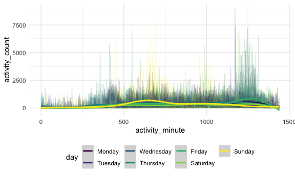
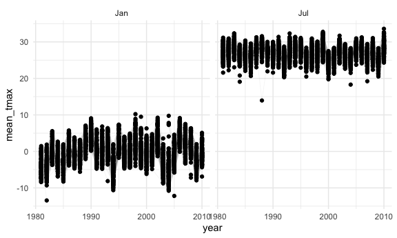
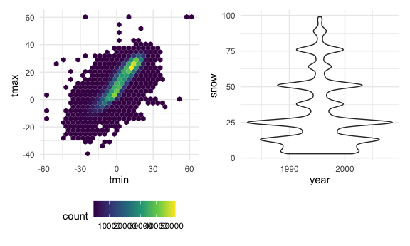

Homework 3
================

``` r
library(tidyverse)
```

    ## ── Attaching packages ────────────────────────────────── tidyverse 1.3.0 ──

    ## ✓ ggplot2 3.3.2     ✓ purrr   0.3.4
    ## ✓ tibble  3.0.3     ✓ dplyr   1.0.2
    ## ✓ tidyr   1.1.2     ✓ stringr 1.4.0
    ## ✓ readr   1.3.1     ✓ forcats 0.5.0

    ## ── Conflicts ───────────────────────────────────── tidyverse_conflicts() ──
    ## x dplyr::filter() masks stats::filter()
    ## x dplyr::lag()    masks stats::lag()

``` r
library(patchwork)
```

``` r
knitr::opts_chunk$set(
  fig.width = 6,
  fig.asp = .6,
  out.width = "90%"
)

theme_set(theme_minimal() + theme(legend.position = "bottom"))

options(
  ggplot2.continuous.colour = "viridis",
  ggplot2.continuous.fill = "viridis"
)

scale_colour_discrete = scale_colour_viridis_d
scale_fill_discrete = scale_fill_viridis_d
```

## Problem 1

``` r
library(p8105.datasets)
data("instacart")
```

The dataset contains information on Instacart Online Grocery Shopping in
2017. The variables order\_id, product\_id, add\_to\_cart\_order,
reordered, user\_id, eval\_set, order\_number, order\_dow,
order\_hour\_of\_day, days\_since\_prior\_order, product\_name,
aisle\_id, department\_id, aisle, department are included in this data
set. This dataset contains 1384617 rows and 15 columns.

How many aisles, and which are most common items from?

``` r
instacart %>%
count(aisle) %>%
  arrange (desc(n))
```

    ## # A tibble: 134 x 2
    ##    aisle                              n
    ##    <chr>                          <int>
    ##  1 fresh vegetables              150609
    ##  2 fresh fruits                  150473
    ##  3 packaged vegetables fruits     78493
    ##  4 yogurt                         55240
    ##  5 packaged cheese                41699
    ##  6 water seltzer sparkling water  36617
    ##  7 milk                           32644
    ##  8 chips pretzels                 31269
    ##  9 soy lactosefree                26240
    ## 10 bread                          23635
    ## # … with 124 more rows

There are 134 aisles in the data set and The most popular aisles are
fresh vegetables, fresh fruits, and packaged vegetables fruits.

``` r
instacart %>%
  count(aisle) %>% 
  filter(n> 10000) %>% 
  mutate(
    aisle = factor(aisle),
    aisle = fct_reorder(aisle, n)
  ) %>%
  ggplot(aes(x=aisle, y=n)) +
  geom_point() + 
  theme(axis.text.x = element_text(angle = 90, vjust = 0.5, hjust =1))
```


Let’s make a table

``` r
instacart %>% 
    filter(aisle %in% c("baking ingredients", "dog food care", "packaged vegetables fruits")) %>% 
    group_by(aisle) %>% 
    count(product_name) %>% 
    mutate(rank = min_rank(desc(n))) %>% 
    filter(rank < 4) %>% 
    arrange(aisle, rank) %>% 
    knitr::kable()
```

| aisle                      | product\_name                                 |    n | rank |
| :------------------------- | :-------------------------------------------- | ---: | ---: |
| baking ingredients         | Light Brown Sugar                             |  499 |    1 |
| baking ingredients         | Pure Baking Soda                              |  387 |    2 |
| baking ingredients         | Cane Sugar                                    |  336 |    3 |
| dog food care              | Snack Sticks Chicken & Rice Recipe Dog Treats |   30 |    1 |
| dog food care              | Organix Chicken & Brown Rice Recipe           |   28 |    2 |
| dog food care              | Small Dog Biscuits                            |   26 |    3 |
| packaged vegetables fruits | Organic Baby Spinach                          | 9784 |    1 |
| packaged vegetables fruits | Organic Raspberries                           | 5546 |    2 |
| packaged vegetables fruits | Organic Blueberries                           | 4966 |    3 |

Apples vs Ice cream

``` r
instacart %>% 
    filter(product_name %in% c("Pink Lady Apples", "Coffee Ice Cream")) %>% 
    group_by(product_name, order_dow) %>% 
    summarize(mean_hour = mean(order_hour_of_day)) %>% 
    pivot_wider(
        names_from = order_dow,
        values_from = mean_hour
    )
```

    ## `summarise()` regrouping output by 'product_name' (override with `.groups` argument)

    ## # A tibble: 2 x 8
    ## # Groups:   product_name [2]
    ##   product_name       `0`   `1`   `2`   `3`   `4`   `5`   `6`
    ##   <chr>            <dbl> <dbl> <dbl> <dbl> <dbl> <dbl> <dbl>
    ## 1 Coffee Ice Cream  13.8  14.3  15.4  15.3  15.2  12.3  13.8
    ## 2 Pink Lady Apples  13.4  11.4  11.7  14.2  11.6  12.8  11.9

## Problem 2

``` r
accel_df = 
read.csv("./data/accel_data.csv") %>%
  janitor::clean_names() %>%
    pivot_longer(
      activity_1:activity_1440, 
      names_to = "activity_minute", 
      names_prefix = "activity_", 
      values_to ="activity_count"
      ) %>%
  
mutate (
  day = factor(day), 
  day = forcats::fct_relevel(day, c("Monday", "Tuesday", "Wednesday", "Thursday", "Friday", "Saturday", "Sunday"))) %>%
    
 mutate(weekend_weekday=day) %>%

mutate(weekend_weekday = recode(weekend_weekday, Sunday = "Weekend", Saturday = "Weekend", Friday = "Weekday",Thursday = "Weekday", Wednesday = "Weekday", Tuesday = "Weekday", Monday = "Weekday")) %>%
  mutate(
     activity_minute = as.numeric(activity_minute))
```

This data set contains 50400 rows and 6 columns. The variables contained
are week, day\_id, day, activity\_minute, activity\_count,
weekend\_weekday

``` r
accel_df  %>%
  group_by(day, week) %>%
  summarize (total_activity = sum(activity_count)) %>%
  pivot_wider(
    names_from = day, 
    values_from = total_activity
  )  %>%
    knitr::kable()
```

    ## `summarise()` regrouping output by 'day' (override with `.groups` argument)

| week |    Monday |  Tuesday | Wednesday | Thursday |   Friday | Saturday | Sunday |
| ---: | --------: | -------: | --------: | -------: | -------: | -------: | -----: |
|    1 |  78828.07 | 307094.2 |    340115 | 355923.6 | 480542.6 |   376254 | 631105 |
|    2 | 295431.00 | 423245.0 |    440962 | 474048.0 | 568839.0 |   607175 | 422018 |
|    3 | 685910.00 | 381507.0 |    468869 | 371230.0 | 467420.0 |   382928 | 467052 |
|    4 | 409450.00 | 319568.0 |    434460 | 340291.0 | 154049.0 |     1440 | 260617 |
|    5 | 389080.00 | 367824.0 |    445366 | 549658.0 | 620860.0 |     1440 | 138421 |

``` r
accel_df  %>%
  ggplot(aes(x= activity_minute, y = activity_count, group = day_id,color=day)) + 
  geom_line(alpha = .2) +
  geom_smooth(aes(group = day)) 
```

    ## `geom_smooth()` using method = 'gam' and formula 'y ~ s(x, bs = "cs")'



## Problem 3

``` r
library(p8105.datasets)
data("ny_noaa")
```

``` r
ny_noaa_df = ny_noaa%>%
  separate(date, into = c("year", "month", "day"), convert = TRUE) %>%
  mutate(
    tmin = as.numeric(tmin), 
    prcp = as.numeric(prcp), 
    tmax = as.numeric(tmax),
    tmin = tmin / 10, 
    tmax = tmax / 10, 
    prcp = prcp / 10,
    month = month.abb[as.factor(month)],
   )
```

The most common observed value for snowfall is NA

``` r
ny_noaa_df %>%
  filter(month == "Jan" |month == "Jul" ) %>%
  group_by(id, year, month) %>%
  summarize(mean_tmax = mean(tmax, na.rm = TRUE)) %>%
  ggplot(aes(x = year, y = mean_tmax, group = id)) + 
  geom_point() +
  geom_path (alpha =.05, size = .3)+
  facet_grid(.~month) +
   theme(legend.position = "bottom")
```

    ## `summarise()` regrouping output by 'id', 'year' (override with `.groups` argument)

    ## Warning: Removed 5970 rows containing missing values (geom_point).

    ## Warning: Removed 5931 row(s) containing missing values (geom_path).



``` r
tmin_max_df = 
ggplot(ny_noaa_df, aes(x=tmin, y = tmax)) +
geom_hex()

snow_df = 
  ny_noaa_df %>%
  drop_na(snow) %>%
  filter(snow > 0 & snow <100) %>%
  ggplot(aes(x=year, y =snow, fill =year)) + 
  geom_violin() +
   theme(legend.position = "bottom")

tmin_max_df + snow_df
```

    ## Warning: Removed 1136276 rows containing non-finite values (stat_binhex).


